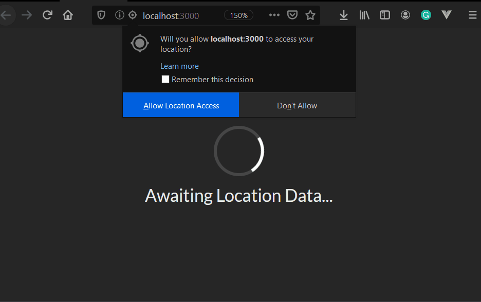

# React Tutorials

## Setup
Kick it off with 
```bash
npx create-react-app [appname]
```

### Linting and formatting
```bash
yarn eslint --init
yarn add --dev prettier eslint-config-prettier eslint-plugin-prettier 
```


## Modern React with Redux - Udemy

### JSX
Simple project to understand JSX syntax, see project readme for comman pitfalls and best practices.

### Components
Introduction to components and props using faker and semantic ui component library.

### Seasons
Project that displays a seasonal message and icon after the result of a location callback, showing a spinner whilst waiting. 



Learning Topics:
- Class components
- Lifecycle methods
- State
- Default Props

### Pics
Allows you to search for a term and get a selection of tiled related images.


Learning Topics
- Controlled Elements
- Axios / Interacting with APIs
- Event Handlers
- Interacting with the DOM

### Videos
