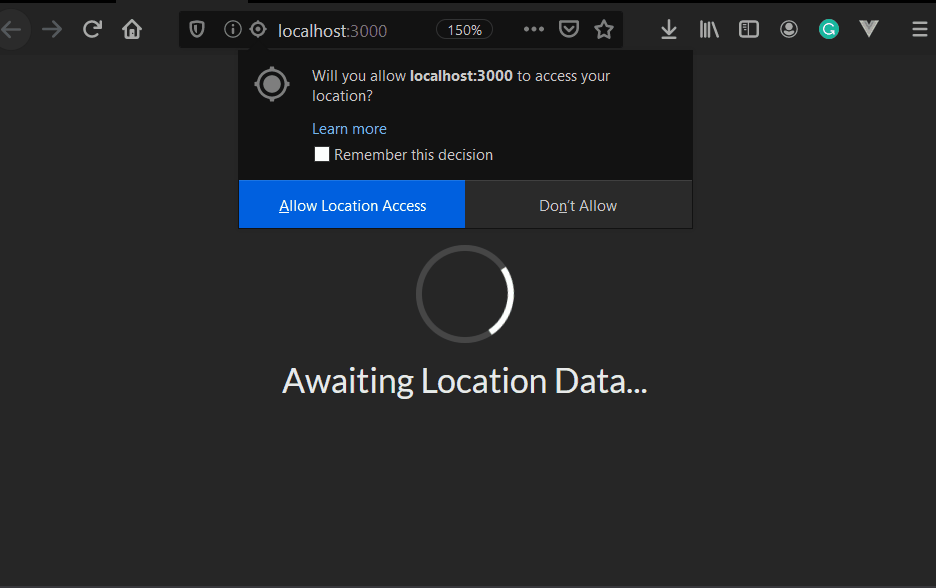

# Seasons Project



## Learnings

### Class-based Components

```javascript
class App extends React.Component {
  constructor(props) {
    super(props); // calls React.Component constructor
  }
...
  render() { // Mandatory lifecycle method
    return <div>Some Div</div>
  }
}
```

### Rules of State
- Unless you are using hooks only class components can use state
- JS Object that only contains data releveant to the component
- A change in state rerenders the component

```javascript
  constructor(props) {
    super(props); // calls React.Component constructor

    this.state = {};
  }
```

  or

``` javascript
class App extends React.Component {
  state = { ... };
}
```

- babel will convert this to constructor for us.
- State must be initialised on component creation
- State can *only* be updated using ```this.setState({ key: value })```

### Lifecycle Methods

- constructor
- render
Avoid conditional returns in render as this can make some future changes more difficult.
- componentDidMount - called after initial render
Best practice is to do data loading and one-time calls in here rather than constructor
- componentDidUpdate - called after render
- componentWillUnmount

Rarer
- shouldComponentUpdate
- getDerivedStateFromProps
- getSnapshotBeforeUpdate

### Default Props

To give a component a default you can use something like ```{ props.message || 'Loading...' } in some cases a better option would be to use defaultProps  (outside of component function/class)
```javascript
ComponentName.defaultProps = {
  message: 'Loading...'
};
```

### CSS

- Good practise to match the component name with a class name, e.g.
```const SeasonDisplay = props => <div className="season-display"></div>```
- ```import './SeasonDisplay.css'``` - webpack will embed into html

## Tutorial Steps

1. Create an class-based 'App' component
2. Create a 'lat' key value in component state
3. Find the users lattitude using
```javascript
window.navigation.geolocation.getCurrentPosition()
```
4. Conditional rendering
- If lattitude returned then show
- If error show error
- otherwise show loading
5. Create a new component 'SeasonDisplay'
6. Use ```new Date().getMonth()``` with lat to determine Summer/Winter
7. Display sun/snowflake icons and message depending on season.
8. Do some nice CSS formatting.
9. Create a loading spinner with default props
